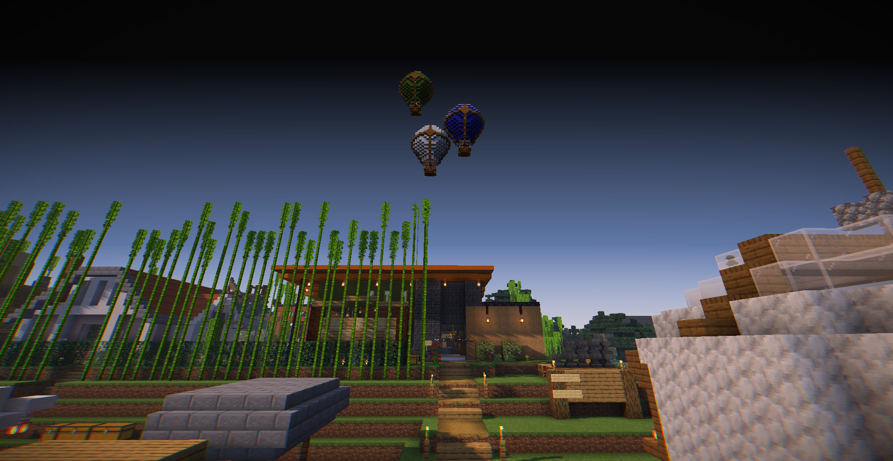

## クリスタについて
このサイトの管理人をしているクリスタです。主にシステム開発であったり、Minecraftのデータパックやプラグインを書いたり、ウェブ開発をしたり...
といろいろなことをしています。一応マイクラ歴をお見せしますと、 

✔  Minecraft歴(統合版): 2021/04 ~  
✔  Minecraft歴(Java版): 2021/10 ~  
✔  データパック歴: 2021/05 ~  
✔  アスレ歴: 2021/12 ~  

実は最近Minecraftを始めたばっかりなんです... なのにデータパックに手を出したのはなんでや! と思われる方もいるでしょう。当時私は我々だ!さんの
Minecraft企画にドハマリしていましてそれを作ってみたい!という軽い気持ちでデータパックに手を出しました。 
MinecraftのWikiなんか毎日読みながらデータパックを書いて別のものを作る...をずっと繰り返してきた結果が現在に至ります。 
最近では、[畳サーバー](https://tatamiserver.com)という統合版でもJava版でも参加できるというMinecraftのサーバーに2021/12月からシステム開発
としてミニゲームなどを開発しています。もし、興味がありましたらサイトより参加方法が表示されますのでぜひご確認ください!

## このサイトについて
このサイトは、このブログの管理人をしているクリスタのプログラミングなどの備忘録的なサイトとして作成しました。
このサイトでは主にMinecraftだったり、ウェブ開発、プラグイン開発などの備忘録、ごくまれにアプリケーションの作業進捗などを
載せていく予定です。 
Minecraft関連は読みやすさ、やりやすさを重視しながら書いていく予定なので温かく見守っていただけると幸いです!

## 利用規約(Team of Use)
この利用規約(以下本規約)は、Crysta Worldがこのウェブサイト上で提供するコンテンツの利用条件を定めるものです。コンテンツを利用する際は、本規約に従って利用することができます。

### 第一条 適用
本規約は、ユーザーとCrysta Worldとの間のコンテンツの利用に関わる一切の関係に適用されるものとします。
CrystaWorldは本サービスに関し、本規約のほか、ご利用にあたってのルール等、各種の定め（以下、「個別規定」）をすることがあります。これら個別規定はその名称のいかんに関わらず、本規約の一部を構成するものとします。
本規約の規定が前条の個別規定の規定と矛盾する場合には、個別規定において特段の定めなき限り、個別規定の規定が優先されるものとします。

### 第二条 禁止事項
ユーザは、本ウェブサイト上のコンテンツを利用するにあたり、以下の行為をしてはなりません。 
- 本コンテンツの一部または本コンテンツを第三者に無断で公開すること
- 本コンテンツを改造あるいは複製し、第三者に公開すること
- 無断で商用利用すること
- 本コンテンツのソースコードを解析し、無断で利用する行為
- 本コンテンツに対する自作発言
- その他Crysta Worldが禁止と判断する行為 
本コンテンツのシステムを真似し、全く同じあるいはそれに値するものを作成・公開あるいは配信する行為(本コンテンツはJava版のみ提供しており統合版には一切提供しておりません。もし、これを見かけた場合はご連絡ください)

### 第三条  定義
本利用規約にある「商用利用」に関する定義について以下の通りとします。
- サーバーを一般公開しており、同時接続しているプレイヤーが30人を超えているサーバーでの利用
- 本コンテンツをCrysta World 公式サーバー以外で課金でしかプレイできないようにするサーバーでの利用(なお、個人で遊ぶために利用するのは商用利用にはなりません。また、これらのサーバーで本コンテンツを利用する場合は必ず許可を取ってからの利用をお願いします。)

### 第四条 コンテンツ停止等
Crysta Worldは、以下の事由があると判断した場合、事前告知なくコンテンツを全部または一部の提供を一時停止あるいは完全に停止することがあります。 
- 本コンテンツになんらかの重大な不具合があった場合
- 本コンテンツを維持するためのサーバーメンテナンスを行う場合
- 本コンテンツの提供が困難になった場合

### 第五条 保証の否認および免責事項
Crysta Worldは、本コンテンツにエラーやバグがないことを明示的にも暗示的にも保証していません。
本コンテンツに起因してユーザーに生じたあらゆる損害について、Crysta World  の故意による場合を除き一切の責任を負いません。

### 第六条 利用規約の変更
Crysta Worldは、ユーザーに対し事前の告知なく本利用規約を変更する場合があります。

### 第七条 個人情報の取り扱い
Crysta Worldは、本コンテンツの提供をする際に個人情報の収集は行っていません。ただし、配布先ページでは別のサービスを利用しております。配布先ページに関する個人情報の取り扱いはそのサービスのプライバシーポリシーをご参照ください。

## コメントポリシー
本サイトの記事や一部ページではいろいろな方とのコミュニケーションを得る場としてコメント機能が有効になっています。健全なコミュニティ維持のために以下
のコメントポリシーを守っていただくようお願いします。
- 礼儀正しく - 誰に対しても失礼にならず、他の人を尊重してください。あなたの言葉が人々に影響を与えることを忘れないでください。
- 誹謗中傷をしない - ここでの執筆者に対する批判は歓迎しますが、議論に価値をもたらさない、または単に侮辱的なコメントは例外なく削除します。
- スパムの禁止 - スパムや他人に迷惑がかかるようなコメントは禁止です。

## お問い合わせ
CrystaWorldに関するお問い合わせは、フォームでのみ受け付けております。以下のリンクよりフォームにご記入の上送信してください。
受け取ってから一週間以内をめどに返信いたします。
