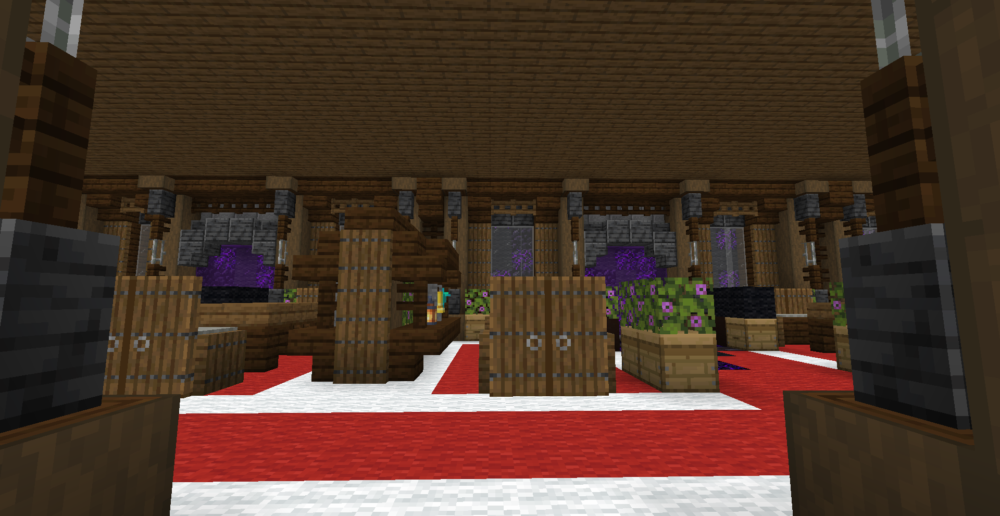
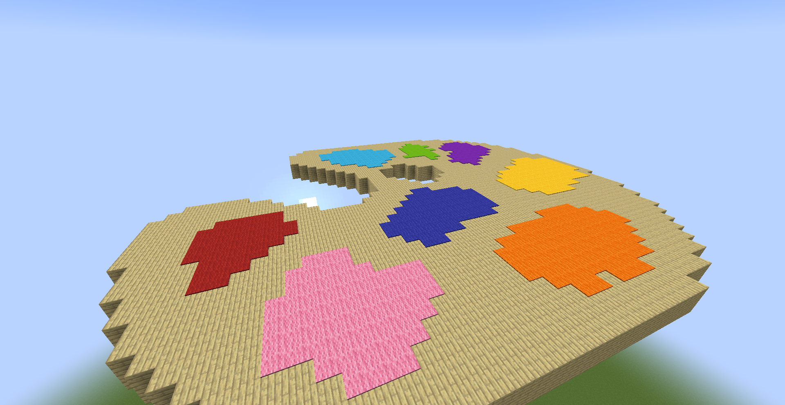
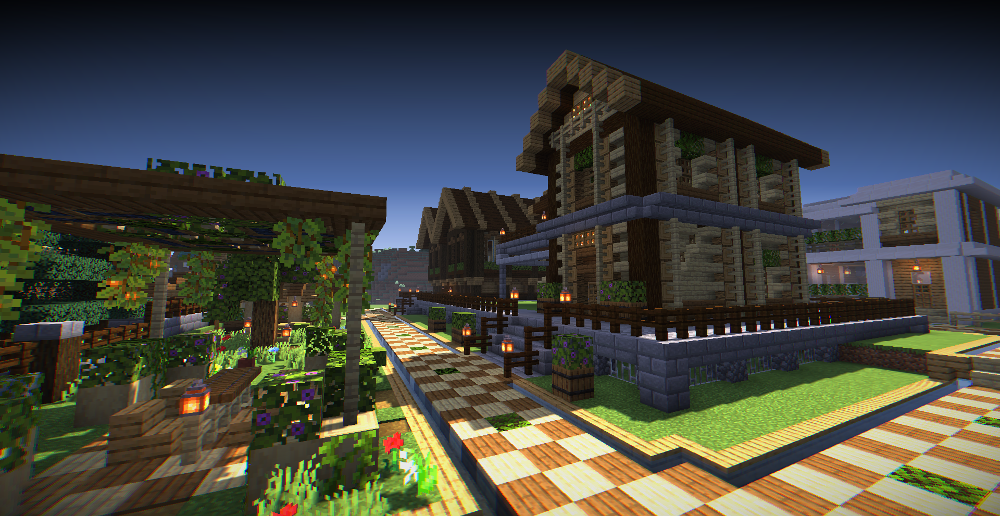
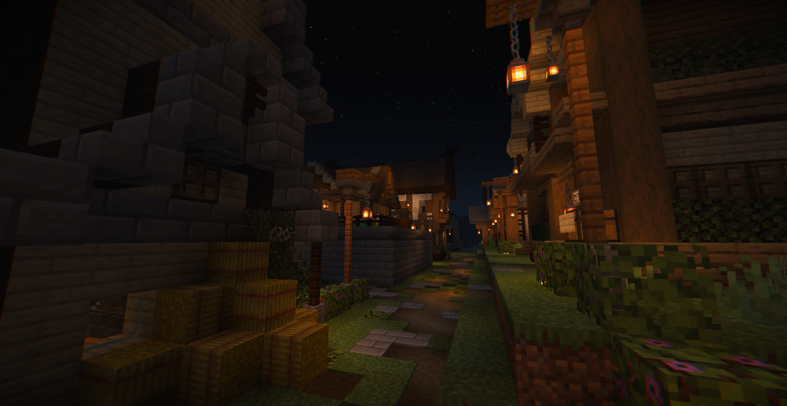

みなさんこんばんは。クリスタです。今回は私がいる畳サーバーというサーバーについて紹介したいと思います!

## 畳サーバーについて
畳サーバーは、統合版・Java版・スマホ版どれでも参加できる公開マインクラフトサーバーです。Nintendo Switchでも設定を変更すれば
参加することができます!畳サーバーに入るには畳サーバー公式Discordに参加する必要があります。

Discordの利用規約上13歳以上ではないと参加することができません! 

詳しくは[コチラ](https://tatamiserver.com/)から畳サーバー公式ホームページをチェック!

## 何をするところ?
畳サーバーではイベントから生活まで様々なコンテンツを用意しています。
 - 逃走中やPvPで楽しめるイベントサーバー
 - お金の概念がある生活サーバー
 - ミニゲームが楽しめる24時間イベントサーバー

**不定期開催!イベントサーバー!**  
不定期で開催されるイベントサーバー!逃走中・PvP・鬼ごっこ・マイクラバカ人狼など、いろんなイベントが楽しめます！
しかもどれもクオリティが高くオリジナル要素も含まれているのでハマること間違いなし!
ほかにもどんなイベントがあるかはコチラからチェック!  
https://tatamiserver.com/event.html

**24時間イベントサーバーでできること**  
24時間イベントサーバーと呼ばれ、高難易度イベント「チャレンジタワー」や新感覚弓PvP「Knock Shot」といったミニゲームが楽しめます!
 
▲チャレンジタワーの様子 
 
▲Knock Shotのバトルエリア 
 
チャレンジタワーは一日一回のみ参加可能!(午前3時リセット) KnockShotはいつでも遊べます!
  

  
**24時間いつでも遊べる生活サーバー!**  
最後に畳サーバーのメインコンテンツの一つ、生活サーバーを紹介! 
生活サーバーには土地が空いていればあなただけの土地を確保でき、自由な建築ができます!もちろん、資源ワールドで探検、お金集めもでき、ガチャチケット
を買ってレアなアイテムを狙おう! (レアなエンチャント付き武器や装備などがごくまれに手に入るぞ!)  
 
 

## 運営募集中!
畳サーバーでは運営を募集しています。「サーバー運営に携わってみたい!」、「イベントを作りたい!」など、少しでも興味がありましたら[コチラ](https://mineidea.net/projects/6160894485)からどうぞ！ 
サーバー運営では生活サーバーを中心に不具合や窃盗などの被害に対応するのが主な仕事です。難しいと思うかもしれませんが慣れると楽しくなりますよ!  
イベントを作ってみたい場合、建築するか・コマンドを作るかどちらかになります。コマンドの場合、データパックというものを主に作っていただくことになります。
プログラミングなんてしたことない...でも作ってみたい! 安心してください! データパックを学ぶことのできる講座がありますので好きな時間に学ぶことができます!

## 最後に
少しでも気になった...参加してみたい...!などありましたら、ぜひご参加ください! 心強いマインクラフターがあなたを待っていますよ!  
これからも不定期で畳サーバーに関する記事を書いていきますのでよければご確認ください! それでは次回の記事でお会いしましょう!  
さようなら!